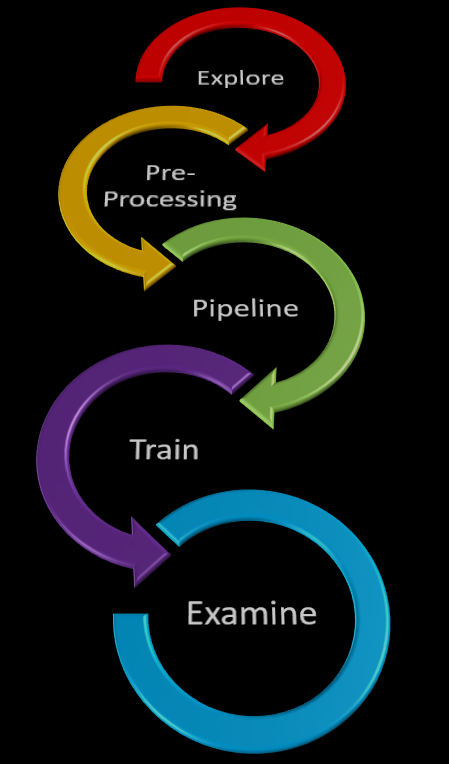

# fmi
> Adding additional functionality to fastai's medical imaging module

## Install

`git clone https://github.com/asvcode/fmi.git`

## Tutorials

[Explore & Preprocessing Tutorial](https://github.com/asvcode/fmi/blob/master/tutorial_nbs/explore_preprocessing_tutorial.ipynb)

[Dicom Splitter Examples](https://github.com/asvcode/fmi/blob/master/tutorial_nbs/dicom_splitter_examples.ipynb)
